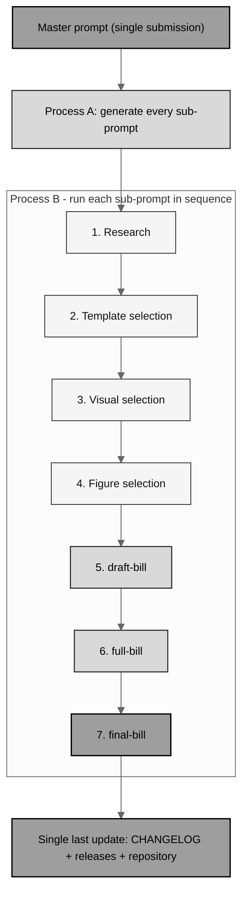

# single-prompt-bill

Utilize a single prompt to generate a complete H. R. 9510 bill version fully
autonomously. Two builds: **v4.0** (`auto-bill-01`) and **v5.0**
(`auto-bill-02`, current).

[](https://creativecommons.org/licenses/by/4.0/)
[](LICENSE)
[-darkblue.svg)](.)
[](.)
[](auto-bill-02)
[-Tables%20%2B%20ASCII%20%2B%20Mermaid-lightgrey.svg)](auto-bill-02)
[-10.5281%2Fzenodo.20619762-blue.svg)](https://doi.org/10.5281/zenodo.20619762)
[-10.5281%2Fzenodo.20576907-blue.svg)](https://doi.org/10.5281/zenodo.20576907)
[](https://doi.org/10.5281/zenodo.20576648)
[](releases.md)

*Independent research draft. Not an enacted law, not pending legislation, and
not legal advice; not endorsed by the FDA, HHS, the CBO, the GAO, the OMB, the
OLRC, CFR, ICH, or any Member of Congress. The illustrative number "H. R.
9510" is a placeholder; the Clerk assigns the real number only at
introduction. All dollar figures in the v5.0 build are illustrative unless
tied to a cited statute or notice.*

This repository holds the autonomous, single-prompt builds of **H. R. 9510**,
the *Verification Before Generation in Physical AI Oncology Trials Act of
2026*, an amendment to the **Federal Food, Drug, and Cosmetic Act** (21 U.S.C.
§ 301 et seq.). Each build is driven by one Master prompt: the agent first
generates all of its own sub-prompts (Process A), then runs them in sequence
(Process B) as the bill grows from `draft-bill` to `full-bill` to
`final-bill`, with every file a separate real-time commit.

## The two builds

| Build | Bill | Theme | The two main updates | Release |
|:--|:--|:--|:--|:--|
| [`auto-bill-01/`](auto-bill-01) | **v4.0** | The Gray-Scale Mermaid Amendment | The twelve deliverables improved and converted to LaTeX appendices; gray-scale Mermaid diagrams only | v1.0.0 |
| [`auto-bill-02/`](auto-bill-02) | **v5.0** | **The Financial Data Amendment** | A comprehensive financial-data focus (the 515D(k) cost record, the SEC. 5 financial core, the twelve-section comparative print, four financial appendices); three media together - tables, ASCII, and gray-scale Mermaid | **v2.0.0** |

## Build pipeline (gray-scale Mermaid)



In the v4.0 build each stage was one merged pull request (nine PRs); in the
v5.0 build the schedule was updated for the single permitted branch: nine
labeled stage milestones, one commit per file pushed in real time, inside one
continuously updated pull request.

## Repository structure

```
single-prompt-bill/
  README.md                     (this file: both builds)
  LICENSE                       (MIT for code; bill content is CC BY 4.0)
  CHANGELOG.md                  (v1.0.0 and v2.0.0 entries)
  releases.md                   (v1.0.0 and v2.0.0 release notes)
  auto-bill-01/                 (Bill v4.0: the Gray-Scale Mermaid Amendment)
    README.md  master-prompt.md  sub-prompts/  01-research/ ... final-bill/
  auto-bill-02/                 (Bill v5.0: the Financial Data Amendment)
    README.md                   (build README: milestones and source map)
    master-prompt.md            (the submitted Master prompt, verbatim)
    sub-prompts/                (Process A: seven updated sub-prompts + README)
    01-research/                (Stage 1: the 2026 financial frame)
    02-template-selection/      (Stage 2: v3.0 base + v4.0 Mermaid merge)
    03-mermaid-selection/       (Stage 3: 6 gray-scale Mermaid + 6 ASCII)
    04-figure-selection/        (Stage 4: 11 figures + cover, 15 tables)
    draft-bill/                 (Stage 5: compiling scaffold + zip)
    full-bill/                  (Stage 6: every slot rendered + zip)
    final-bill/                 (Stage 7: polished, v2.0.0 + zip)
```

## Cross-repository sources (Rule 6)

Every directory README names the exact upstream files it used. The
project-level map for the current (v5.0) build:

| Used in v5.0 | Upstream source |
|:--|:--|
| The bill measure built from (operative text, print, ASCII and table style) | `cancer-automated/.../papers/VVUQ-05/final-bill` (no `/deliverables`) |
| The process adapted (Master prompt, sub-prompts, Mermaid TikZ primitives) | `single-prompt-bill/auto-bill-01` |
| Mermaid diagram families | `Clinical-AI-Demos/.../ai-outputs/output-01` |
| ASCII visual catalog and figure taxonomy | `cancer-automated/.../VVUQ-05/update-bill/figures-bill` |
| Pre-introduction research method | `cancer-automated/.../VVUQ-05/update-bill/next-steps` |

## Versioning

- **Bill content versions:** v1.0 (VVUQ-03), v2.0 (VVUQ-04), v3.0 (VVUQ-05),
  **v4.0** (`auto-bill-01`), **v5.0** (`auto-bill-02`, current).
- **Repository releases:** **v1.0.0** (the v4.0 build), **v2.0.0** (the v5.0
  build, current) - see [`CHANGELOG.md`](CHANGELOG.md) and
  [`releases.md`](releases.md).
- **DOIs:** Bill v4.0
  [10.5281/zenodo.20576907](https://doi.org/10.5281/zenodo.20576907); Bill
  v5.0 `10.5281/zenodo.20619762`
  ([https://doi.org/10.5281/zenodo.20619762](https://doi.org/10.5281/zenodo.20619762))
  pending deposit (Rule 15); repository
  [10.5281/zenodo.20576648](https://doi.org/10.5281/zenodo.20576648).

## Responsible use and license

The reproduced statutory text is a work of the United States Government in the
public domain (17 U.S.C. § 105); the authoritative version is the United
States Code as published by the Office of the Law Revision Counsel. The
generated amendment framing, figures, tables, deliverables, and documentation
are released under the **Creative Commons Attribution 4.0 International
License (CC BY 4.0)**; the repository code and tooling are under the **MIT
License** (`LICENSE`).

Prepared by CEO Kevin Kawchak
([ORCID 0009-0007-5457-8667](https://orcid.org/0009-0007-5457-8667)),
ChemicalQDevice ([kevink@chemicalqdevice.com](mailto:kevink@chemicalqdevice.com)),
with Claude Code (Anthropic autonomous coding agent, 1M context).
