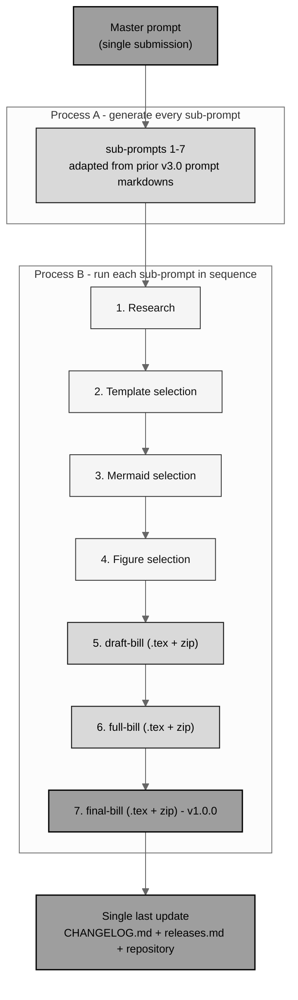

# single-prompt-bill

Utilize a single prompt to generate **H. R. 9510 v4.0** fully autonomously.

[](https://creativecommons.org/licenses/by/4.0/)
[](LICENSE)
[-darkblue.svg)](.)
[](.)
[](.)
[-10.5281%2Fzenodo.20576907-blue.svg)](https://doi.org/10.5281/zenodo.20576907)
[](https://doi.org/10.5281/zenodo.20576648)
[](releases.md)

*Independent research draft. Not an enacted law, not pending legislation, and not
legal advice; not endorsed by the FDA, HHS, the OLRC, CFR, ICH, or any Member of
Congress. The illustrative number "H. R. 9510" is a placeholder; the Clerk assigns
the real number only at introduction.*

This repository is the autonomous, single-prompt build of **H. R. 9510 Bill
v4.0**, the *Verification Before Generation in Physical AI Oncology Trials Act of
2026*, an amendment to the **Federal Food, Drug, and Cosmetic Act** (21 U.S.C.
§ 301 et seq.). It was produced from one Master prompt by **Claude Code Opus 4.8
(1M context) Max**, which first generated all of its own sub-prompts and then ran
them in sequence as the bill grew from `draft-bill` to `full-bill` to
`final-bill`, committing and opening pull requests in real time so the branch
progress can be monitored without any user intervention.

## The two main updates over Bill v3.0

- **(a) Twelve deliverables, improved and converted to LaTeX.** The twelve
  submission deliverables that Bill v3.0 carried as standalone Markdown
  (`cancer-automated/papers/VVUQ-05/final-bill/deliverables`) are improved,
  updated, and **rewritten as LaTeX appendices that compile inside the bill**,
  each represented by an entry in the bill's clickable table of contents.
- **(b) Gray-scale Mermaid diagrams only.** Every diagram in this project is a
  **gray-scale Mermaid diagram**. There are no raster images anywhere. In the
  Markdown files the diagrams are real `mermaid` blocks (GitHub renders them); in
  the compiled LaTeX bill each diagram is reproduced as a **gray-scale TikZ
  figure** that matches the Mermaid source, because Overleaf does not render
  Mermaid natively and no image files are permitted (Rule 5).

## Build pipeline (gray-scale Mermaid)



## Prompt schedule

| # | Stage | Output | Adapted from (prior v3.0 source) | PR |
|:--|:--|:--|:--|:--|
| - | Bootstrap (Process A) | `README.md`, `auto-bill-01/`, all sub-prompts | this Master prompt | PR 1 |
| 1 | Automatic research | `01-research/` | `VVUQ-05/update-bill/next-steps/prompt-1-next-steps.md` | PR 2 |
| 2 | Template selection | `02-template-selection/` | `Clinical-AI-Demos/ai-outputs/output-02` or `output-03` | PR 3 |
| 3 | Mermaid selection | `03-mermaid-selection/` | `Clinical-AI-Demos/ai-outputs/output-01` | PR 4 |
| 4 | Figure selection | `04-figure-selection/` | `VVUQ-05/update-bill/figures-bill/prompt-figures-bill.md` | PR 5 |
| 5 | Bill draft | `draft-bill/` (.tex + zip) | `VVUQ-05/draft-bill/prompt-draft-bill.md` | PR 6 |
| 6 | Bill full | `full-bill/` (.tex + zip) | `VVUQ-05/full-bill/prompt-full-bill.md` | PR 7 |
| 7 | Bill final (v1.0.0) | `final-bill/` (.tex + zip) | `VVUQ-05/final-bill` | PR 8 |
| - | Release (Rule 10) | `CHANGELOG.md`, `releases.md`, repository | `VVUQ-05/full-bill/prompt-full-bill.md` | PR 9 |

## Repository structure

```
single-prompt-bill/
  README.md                     (this file: comprehensive project README)
  LICENSE                       (MIT for code; bill content is CC BY 4.0)
  CHANGELOG.md                  (added in the final v1.0.0 release update)
  releases.md                   (added in the final v1.0.0 release update)
  auto-bill-01/
    README.md                   (build README: provenance and cross-repo source map)
    master-prompt.md            (the single submitted Master prompt, verbatim)
    sub-prompts/                (Process A: all seven generated sub-prompts + README)
    01-research/                (Stage 1: pre-introduction research, current for 2026)
    02-template-selection/      (Stage 2: chosen LaTeX template set + justification)
    03-mermaid-selection/       (Stage 3: gray-scale Mermaid diagram set)
    04-figure-selection/        (Stage 4: figure-type plan, Mermaid throughout)
    draft-bill/                 (Stage 5: scaffold bill .tex + sections + zip)
    full-bill/                  (Stage 6: full bill .tex + 12 deliverables + zip)
    final-bill/                 (Stage 7: polished bill .tex + 12 deliverables + zip)
```

## Cross-repository sources (Rule 6)

Every directory README names the exact upstream files it used. The project-level map:

| Used here | Upstream source | Where used |
|:--|:--|:--|
| Research method and 2026 facts | `cancer-automated/.../VVUQ-05/update-bill/next-steps` | `01-research/` |
| LaTeX template set (genre-diverse) | `Clinical-AI-Demos/.../ai-outputs/output-03` | `02-template-selection/`, all bills |
| Mermaid diagram families | `Clinical-AI-Demos/.../ai-outputs/output-01` | `03-mermaid-selection/`, all bills |
| Visual catalog and figure types | `cancer-automated/.../VVUQ-05/update-bill/figures-bill` | `04-figure-selection/`, all bills |
| Draft scaffold conventions | `cancer-automated/.../VVUQ-05/draft-bill` | `draft-bill/` |
| Full-bill rendering conventions | `cancer-automated/.../VVUQ-05/full-bill` | `full-bill/` |
| Final polish, the 12 deliverables, `usctitle.sty` | `cancer-automated/.../VVUQ-05/final-bill` | `final-bill/`, all bills |

## Versioning

- **Bill content version:** H. R. 9510 **v4.0** (the fourth bill perspective, after
  VVUQ-03 v1.0, VVUQ-04 v2.0, and VVUQ-05 v3.0).
- **Repository release:** **v1.0.0** (the first tagged release of this repository).
- **DOIs** for the final Bill are updated from `10.5281/zenodo.xxxxxxxx`
  ([https://doi.org/10.5281/zenodo.20576907](https://doi.org/10.5281/zenodo.20576907))
  pending deposit (Rule 15).

## Responsible use and license

The reproduced statutory text is a work of the United States Government in the
public domain (17 U.S.C. § 105); the authoritative version is the United States
Code as published by the Office of the Law Revision Counsel. The generated
amendment framing, figures, tables, deliverables, and documentation are released
under the **Creative Commons Attribution 4.0 International License (CC BY 4.0)**;
the repository code and tooling are under the **MIT License** (`LICENSE`).

Prepared by CEO Kevin Kawchak
([ORCID 0009-0007-5457-8667](https://orcid.org/0009-0007-5457-8667)),
ChemicalQDevice ([kevink@chemicalqdevice.com](mailto:kevink@chemicalqdevice.com)),
with Claude Code Opus 4.8 (1M context) Max.
