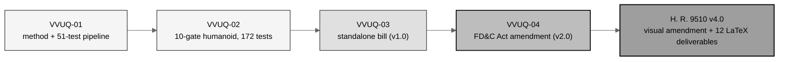
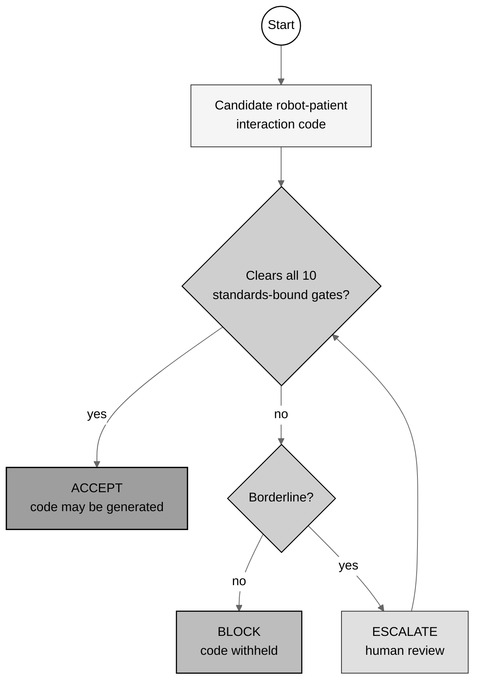
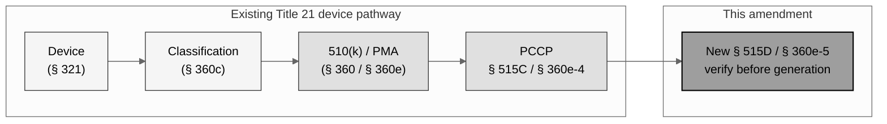
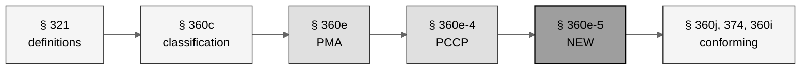
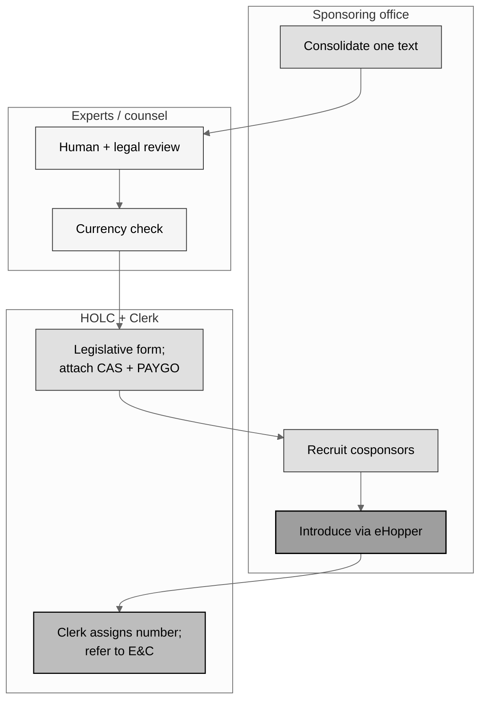
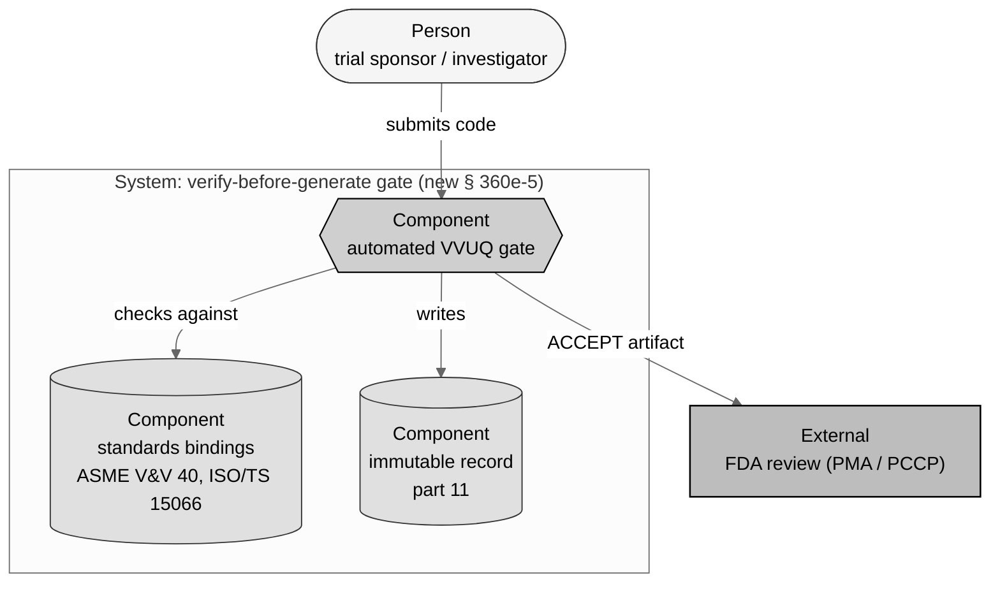
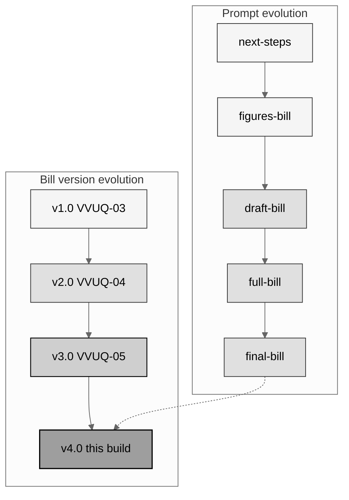

## output-3-mermaid-selection

# Gray-scale Mermaid diagram set for H. R. 9510 v4.0

*Independent research draft. Every diagram below is gray-scale Mermaid (no color,
no images, Rule 5). Each renders directly in GitHub; in the compiled LaTeX bill the
same diagram is reproduced as a matching gray-scale TikZ figure (Overleaf does not
render Mermaid and no raster image is permitted).*

The source families are the colored Mermaid diagrams in
`Clinical-AI-Demos/tree/main/ai-outputs/output-01/ChatGPT.md` (original workflow,
PlantUML component and sequence, D2 declarative map, Excalidraw sketch board,
Graphviz/DOT clustered flow, Structurizr/C4 architecture, BPMN workflow, draw.io
swimlane, hybrid). Each is converted to gray-scale and re-themed from the
software-publication workflow to this bill's subject. **Different and most relevant
diagram types are used throughout, so no figure repeats another's pattern.**

## Shared gray-scale palette

All diagrams use Mermaid's `neutral` theme plus five explicit gray fills, black
strokes, and black text:

- `g1` `#f5f5f5` (lightest) - inputs / context
- `g2` `#e0e0e0` - process steps
- `g3` `#cfcfcf` - decisions / gates
- `g4` `#bdbdbd` - law / statute
- `g5` `#9e9e9e` (darkest) - end goals / the bill

## Figure-slot map

| Fig. | Diagram type (source family) | Bill location | Gray-scale subject |
|:--|:--|:--|:--|
| 1 | Flowchart LR (original workflow) | SEC. 2 | Four-work evidence-to-law lineage |
| 2 | Flowchart TB, paired columns (D2 map) | SEC. 2 | Accelerated timeline vs conventional |
| 3 | BPMN flowchart (BPMN workflow) | SEC. 3 | Ten-gate decision rule and funnel |
| 4 | Component/clustered (Graphviz/DOT) | SEC. 3 | Statutory layering through Title 21 |
| 5 | Flowchart LR (PlantUML component) | SEC. 4 | Comparative-print section order |
| 6 | Swimlane (draw.io) | App. C / App. J | Pre-introduction path by actor |
| 7 | Sequence (PlantUML sequence) | App. L | Evidence to introduction handoff |
| 8 | C4 architecture (Structurizr/C4) | App. C | The verification gate as a system |
| 9 | Flowchart TB (hybrid) | App. K | Prompt and bill-version evolution |

---

## Figure 1 - Four-work evidence-to-law lineage (flowchart LR)



## Figure 2 - Accelerated timeline versus conventional methods (paired flowchart)

```mermaid
%%{init: {'theme':'neutral'}}%%
flowchart TB
    subgraph CONV["Conventional path (months to years)"]
      C1["Method paper ~ months"]:::g1
      C2["Verified robotics code 6-18 mo"]:::g1
      C3["Manuscript ~ months"]:::g1
      C4["Federal bill + counsel mo-years"]:::g1
      C1 --> C2 --> C3 --> C4
    end
    subgraph THIS["This work (about 11 days)"]
      T1["VVUQ-01 ~ 5 days"]:::g2
      T2["VVUQ-02 ~ 2 days"]:::g2
      T3["VVUQ-03 ~ 1 day"]:::g2
      T4["VVUQ-04 ~ 2 days"]:::g2
      T1 --> T2 --> T3 --> T4
    end
    classDef g1 fill:#f5f5f5,stroke:#333,stroke-width:1px,color:#000
    classDef g2 fill:#cfcfcf,stroke:#000,stroke-width:1.2px,color:#000
```



## Figure 3 - Ten-gate decision rule and funnel (BPMN flowchart)



## Figure 4 - Statutory layering through Title 21 (clustered component)



## Figure 5 - Comparative-print section order (component flowchart)



## Figure 6 - Pre-introduction path by actor (swimlane)



## Figure 7 - Evidence to introduction handoff (sequence)

```mermaid
%%{init: {'theme':'neutral'}}%%
sequenceDiagram
    autonumber
    actor K as Author (human)
    participant AI as Claude Code Opus 4.8
    participant T as VVUQ gates / tests
    participant L as Legislative Counsel
    participant H as House (eHopper)
    K->>AI: Requirements (verify before generation)
    AI->>T: Generate + run assurance suite
    T-->>AI: 172/172 tests; 10 gates clear
    AI->>K: Draft -> full -> final bill + deliverables
    K->>L: Route final text for legislative form
    L-->>K: Introduction-ready measure
    K->>H: Sponsor introduces; Clerk assigns number
```

## Figure 8 - The verification gate as a system (C4 architecture)



## Figure 9 - Prompt and bill-version evolution (hybrid flowchart)



---

## Conversion notes for the LaTeX bill

- Each diagram maps to one `mermaidfig` slot in the bill. The LaTeX `usctitle.sty`
  defines TikZ node styles `mmg1`..`mmg5` matching the five gray fills, plus a
  `mermaidfig` environment that centers the diagram on a white background with a
  thin black frame and a figure caption, exactly as the prior bill's `asciifig`
  centered its ASCII art.
- Node shapes follow the Mermaid source: rounded rectangles for steps, diamonds for
  decisions (BPMN/decision diagrams), stadiums for persons, hexagons/cylinders for
  components (C4), and lanes for swimlanes.
- Gray-scale only: no color survives the conversion; emphasis is by gray level and
  stroke weight, matching the palette above.
