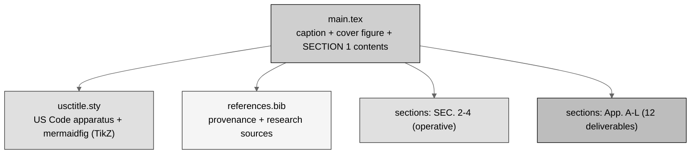

# draft-bill (LaTeX): H. R. 9510 Bill v4.0 scaffold

[](https://creativecommons.org/licenses/by/4.0/)
[-orange.svg)](.)
[](.)
[-lightgrey.svg)](.)
[-10.5281%2Fzenodo.xxxxxxxx-blue.svg)](https://doi.org/10.5281/zenodo.xxxxxxxx)
[](.)

The **draft (scaffold)** of H. R. 9510 Bill v4.0, the *Verification Before
Generation in Physical AI Oncology Trials Act of 2026*, an amendment to the
**Federal Food, Drug, and Cosmetic Act** (21 U.S.C. § 301 et seq.). It fixes the
full structure (caption; A BILL; SECTION 1 with a clickable, page-filling table of
contents; SEC. 2 findings; SEC. 3 the new section 515D; SEC. 4 comparative print)
and the **twelve deliverable appendices (Appendix A through Appendix L)**, each
carrying bracketed `[DRAFTING INSTRUCTIONS]` that name the exact upstream source and
the gray-scale Mermaid figure the full bill will render. The cover figure is a
rendered gray-scale Mermaid (TikZ) diagram; there are no images.

## Bill structure (gray-scale Mermaid)



## Repository structure

```
auto-bill-01/draft-bill/
  README.md                 (this file)
  main.tex                  (caption, cover figure, SECTION 1 contents, inputs, back matter)
  usctitle.sty              (US Code reproduction + amendment apparatus + gray-scale
                             mermaidfig (TikZ) + clickable table of contents)
  references.bib            (provenance and research sources; ieeetr)
  draft-bill-LaTeX.zip      (Overleaf-ready bundle)
  prompt-draft-bill.md      (the generating sub-prompt, verbatim)
  output-draft-bill.md      (the narrative output of this stage)
  sections/
    s2-findings.tex  s3-amendment.tex  s4-comparative.tex          (operative)
    a-one-page-summary.tex          g-paygo-cost.tex
    b-section-by-section.tex        h-sponsor-cosponsor.tex
    c-policy-memo.tex               i-stakeholder.tex
    d-findings.tex                  j-counsel-routing.tex
    e-ramseyer.tex                  k-currency-matrix.tex
    f-constitutional-authority.tex  l-testimony-influence.tex
```

## The twelve deliverable appendices (Rule 2)

Each appendix is the LaTeX home of one deliverable from
`cancer-automated/.../VVUQ-05/final-bill/deliverables`, converted with the matching
output-03 genre. In this scaffold each is a bracketed instruction set; the full bill
renders them.

| App. | Deliverable source (.md) | output-03 genre |
|:--|:--|:--|
| A | `01-one-page-summary.md` | executive one-pager |
| B | `02-section-by-section-analysis.md` | per-section gloss |
| C | `03-plain-english-policy-memo.md` | policy memorandum |
| D | `04-legislative-findings.md` | findings of fact |
| E | `05-ramseyer-comparative-print.md` | Ramseyer redline |
| F | `06-constitutional-authority-statement.md` | formal statement |
| G | `07-paygo-and-cost-estimate.md` | fiscal note |
| H | `08-sponsor-and-cosponsor-packet.md` | recruitment packet |
| I | `09-stakeholder-engagement-plan.md` | engagement plan |
| J | `10-legislative-counsel-routing-memo.md` | routing memo |
| K | `11-currency-and-cross-reference-matrix.md` | audit matrix |
| L | `12-testimony-and-research-influence-brief.md` | hearing testimony |

## Sources used from other repositories (Rule 6)

| Used here | Upstream source | Where used |
|:--|:--|:--|
| Bill apparatus and style | `cancer-automated/.../VVUQ-05/final-bill/usctitle.sty` | `usctitle.sty` (adapted; ASCII figure -> mermaidfig) |
| Provenance and research bib | `cancer-automated/.../VVUQ-05/final-bill/references.bib` | `references.bib` |
| Operative section content | `cancer-automated/.../VVUQ-05/final-bill/sections/s2..s4` | SEC. 2-4 drafting instructions |
| The twelve deliverables | `cancer-automated/.../VVUQ-05/final-bill/deliverables/01..12` | App. A-L drafting instructions |
| Gray-scale Mermaid figures | `auto-bill-01/03-mermaid-selection` | cover figure; figure slots |
| Figure and table plan | `auto-bill-01/04-figure-selection` | figure and table slots |
| Genre devices | `Clinical-AI-Demos/.../ai-outputs/output-03` | appendix genres |

## Compile recipe (Overleaf, pdfLaTeX)

```
pdflatex main.tex
bibtex   main
pdflatex main.tex
pdflatex main.tex
```

Set the Overleaf compiler to **pdfLaTeX**. The body font is Times-like via
`newtxtext`/`newtxmath` (standard on Overleaf); gray-scale figures use `tikz`.
There are no images and no external assets. `draft-bill-LaTeX.zip` is the
Overleaf-ready bundle.

## License

Released under CC BY 4.0; reproduced public-domain U.S. Government statutory text is
used under 17 U.S.C. § 105. Author: Kevin Kawchak, CEO ChemicalQDevice
([ORCID 0009-0007-5457-8667](https://orcid.org/0009-0007-5457-8667)).
