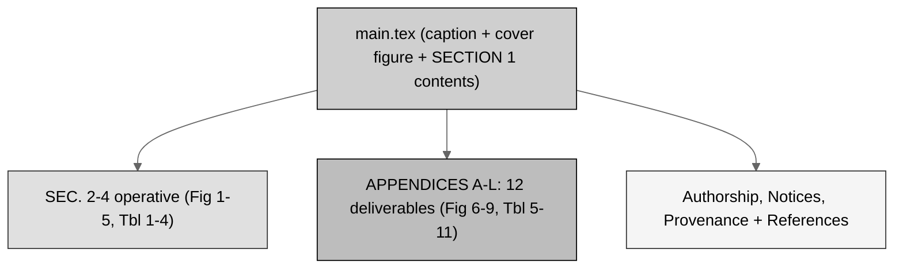

# final-bill (LaTeX): H. R. 9510 Bill v4.0 - polished, v1.0.0

[](https://creativecommons.org/licenses/by/4.0/)
[-brightgreen.svg)](.)
[](.)
[-lightgrey.svg)](.)
[-10.5281%2Fzenodo.20576907-blue.svg)](https://doi.org/10.5281/zenodo.20576907)
[](../../releases.md)
[](.)

The **polished, final** H. R. 9510 Bill v4.0, the *Verification Before Generation in
Physical AI Oncology Trials Act of 2026*, an amendment to the **Federal Food, Drug,
and Cosmetic Act** (21 U.S.C. § 301 et seq.), current through **Public Law 119-93**.
It is the [`../full-bill`](../full-bill) with the senior-author corrections learned
across the prior draft-to-full-to-final cycle, and it marks **repository release
v1.0.0**. Its context and formatting quality are intended to match and exceed the
prior VVUQ-05 final-bill. No images; every diagram is a gray-scale Mermaid figure
rendered in TikZ (Rule 5).

## The polish applied (full bill to final bill)

1. **Page balancing** with `\clearpage`, `\vspace`, and `\hspace`: SEC. 3 and SEC. 4
   begin on fresh pages, and a clean divider opens the appendices, so each part is
   self-standing.
2. **Reference white-space formatting** with no stranded single-word lines and no
   link off the margin (Rule 3).
3. **Consistency pass**: Figures 1 to 9 and Tables 1 to 11 uniquely numbered; the
   Appendix F supporting table made unnumbered to remove a collision; single hyphens
   only; § only in tables; white background throughout.

## Bill structure (gray-scale Mermaid)



## Repository structure

```
auto-bill-01/final-bill/
  README.md   main.tex   usctitle.sty   references.bib
  final-bill-LaTeX.zip   prompt-final-bill.md   output-final-bill.md
  sections/
    s2-findings.tex  s3-amendment.tex  s4-comparative.tex   (operative)
    a-one-page-summary.tex          g-paygo-cost.tex
    b-section-by-section.tex        h-sponsor-cosponsor.tex
    c-policy-memo.tex               i-stakeholder.tex
    d-findings.tex                  j-counsel-routing.tex
    e-ramseyer.tex                  k-currency-matrix.tex
    f-constitutional-authority.tex  l-testimony-influence.tex
```

## The twelve deliverable appendices (Rule 2)

| App. | Deliverable | Source (.md) | Carries |
|:--|:--|:--|:--|
| A | One-page summary | `01-one-page-summary.md` | Tbl 5 |
| B | Section-by-section analysis | `02-section-by-section-analysis.md` | - |
| C | Plain-English policy memo | `03-plain-english-policy-memo.md` | Fig 8 |
| D | Legislative findings | `04-legislative-findings.md` | Tbl 6 |
| E | Ramseyer comparative print | `05-ramseyer-comparative-print.md` | - |
| F | Constitutional Authority Statement | `06-constitutional-authority-statement.md` | - |
| G | PAYGO and cost estimate | `07-paygo-and-cost-estimate.md` | Tbl 7 |
| H | Sponsor and cosponsor packet | `08-sponsor-and-cosponsor-packet.md` | - |
| I | Stakeholder engagement plan | `09-stakeholder-engagement-plan.md` | Tbl 8 |
| J | Legislative Counsel routing memo | `10-legislative-counsel-routing-memo.md` | Tbl 9, Fig 6 |
| K | Currency and cross-reference matrix | `11-currency-and-cross-reference-matrix.md` | Tbl 10, Fig 9 |
| L | Testimony and research-influence brief | `12-testimony-and-research-influence-brief.md` | Tbl 11, Fig 7 |

All twelve sources are in `cancer-automated/.../VVUQ-05/final-bill/deliverables`.

## Sources used from other repositories (Rule 6)

| Used here | Upstream source | Where used |
|:--|:--|:--|
| Bill apparatus, style, polish conventions | `cancer-automated/.../VVUQ-05/final-bill/usctitle.sty` and `main.tex` | `usctitle.sty`, `main.tex` |
| Provenance and research bib | `cancer-automated/.../VVUQ-05/final-bill/references.bib` | `references.bib` |
| Operative section content | `cancer-automated/.../VVUQ-05/final-bill/sections/s2..s4` | SEC. 2-4 |
| Deliverables 01-12 | `cancer-automated/.../VVUQ-05/final-bill/deliverables/01..12` | App. A-L |
| Gray-scale Mermaid figures | `auto-bill-01/03-mermaid-selection` | Figures (TikZ) |
| Figure and table plan | `auto-bill-01/04-figure-selection` | Figure and table placement |
| Appendix genres | `Clinical-AI-Demos/.../ai-outputs/output-03` | App. A-L genres |

## Compile recipe (Overleaf, pdfLaTeX)

```
pdflatex main.tex
bibtex   main
pdflatex main.tex
pdflatex main.tex
```

Set the Overleaf compiler to **pdfLaTeX**. Gray-scale figures use `tikz`; there are
no images. `final-bill-LaTeX.zip` is the Overleaf-ready bundle.

## License

Released under CC BY 4.0; reproduced public-domain U.S. Government statutory text is
used under 17 U.S.C. § 105. Author: Kevin Kawchak, CEO ChemicalQDevice
([ORCID 0009-0007-5457-8667](https://orcid.org/0009-0007-5457-8667)).
