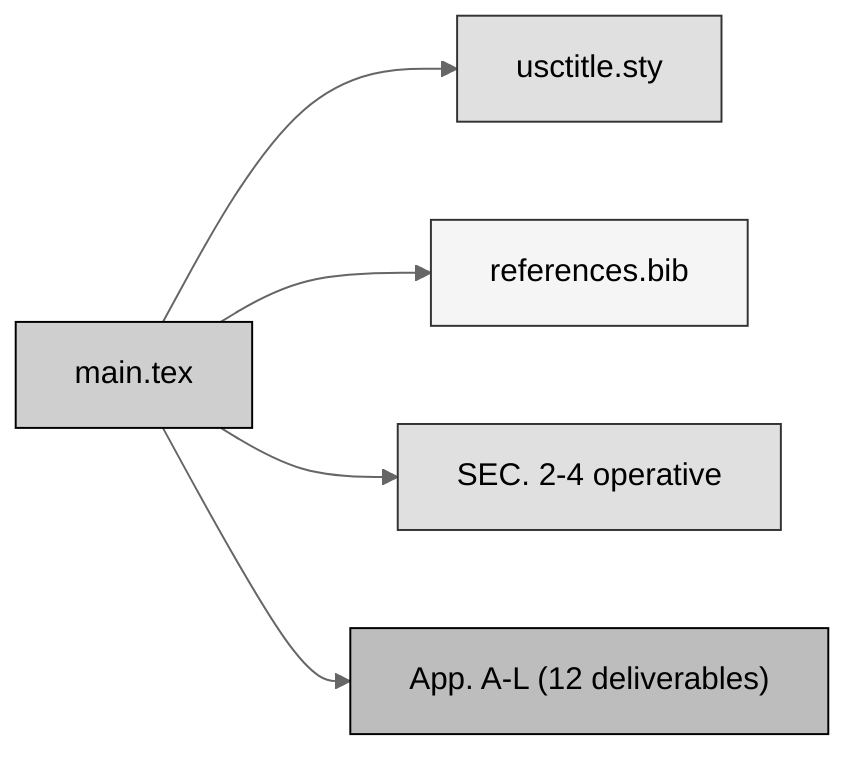

# full-bill (LaTeX): H. R. 9510 Bill v4.0

[](https://creativecommons.org/licenses/by/4.0/)
[-orange.svg)](.)
[](.)
[-lightgrey.svg)](.)
[-10.5281%2Fzenodo.xxxxxxxx-blue.svg)](https://doi.org/10.5281/zenodo.xxxxxxxx)
[](.)

The **full, rendered** H. R. 9510 Bill v4.0, the *Verification Before Generation in
Physical AI Oncology Trials Act of 2026*, an amendment to the **Federal Food, Drug,
and Cosmetic Act** (21 U.S.C. § 301 et seq.), current through **Public Law 119-93**.
Built from the [`../draft-bill`](../draft-bill) scaffold by executing every bracketed
drafting instruction: every gray-scale Mermaid figure is rendered in TikZ, every
full-width table is filled, the operative amendment is carried in full, and all
**twelve deliverables are written as LaTeX appendices** (Appendix A through Appendix
L), each listed in the clickable table of contents (Rule 2). No images (Rule 5).

## Bill structure (gray-scale Mermaid)



## Repository structure

```
auto-bill-01/full-bill/
  README.md   main.tex   usctitle.sty   references.bib
  full-bill-LaTeX.zip   prompt-full-bill.md   output-full-bill.md
  sections/
    s2-findings.tex  s3-amendment.tex  s4-comparative.tex   (operative)
    a-one-page-summary.tex          g-paygo-cost.tex
    b-section-by-section.tex        h-sponsor-cosponsor.tex
    c-policy-memo.tex               i-stakeholder.tex
    d-findings.tex                  j-counsel-routing.tex
    e-ramseyer.tex                  k-currency-matrix.tex
    f-constitutional-authority.tex  l-testimony-influence.tex
```

## Bill parts

| Part | File | Role |
|:--|:--|:--|
| SECTION 1 | `main.tex` | Short title; clickable page-filling table of contents |
| SEC. 2 | `sections/s2-findings.tex` | Findings; Fig. 1 lineage, Tbl. 1, Fig. 2 timeline |
| SEC. 3 | `sections/s3-amendment.tex` | New section 515D + conforming; Tbl. 2, Fig. 3, Fig. 4, Tbl. 3 |
| SEC. 4 | `sections/s4-comparative.tex` | Comparative print; Tbl. 4, Fig. 5, reproduced provisions |
| App. A | `sections/a-one-page-summary.tex` | One-page summary; Tbl. 5 |
| App. B | `sections/b-section-by-section.tex` | Section-by-section analysis |
| App. C | `sections/c-policy-memo.tex` | Policy memo; Fig. 8 |
| App. D | `sections/d-findings.tex` | Legislative findings; Tbl. 6 |
| App. E | `sections/e-ramseyer.tex` | Ramseyer comparative print |
| App. F | `sections/f-constitutional-authority.tex` | Constitutional Authority Statement |
| App. G | `sections/g-paygo-cost.tex` | PAYGO and cost; Tbl. 7 |
| App. H | `sections/h-sponsor-cosponsor.tex` | Sponsor and cosponsor packet |
| App. I | `sections/i-stakeholder.tex` | Stakeholder engagement; Tbl. 8 |
| App. J | `sections/j-counsel-routing.tex` | Legislative Counsel routing; Tbl. 9, Fig. 6 |
| App. K | `sections/k-currency-matrix.tex` | Currency matrix; Tbl. 10, Fig. 9 |
| App. L | `sections/l-testimony-influence.tex` | Testimony and influences; Tbl. 11, Fig. 7 |

## Figure and table inventory (gray-scale Mermaid; full-width tables)

Cover figure plus Figures 1 to 9 (lineage, timeline, gate decision, statutory
layering, section order, pre-introduction path, handoff sequence, the gate as a
system, prompt and bill-version evolution) and Tables 1 to 11.

## Sources used from other repositories (Rule 6)

| Used here | Upstream source | Where used |
|:--|:--|:--|
| Bill apparatus and style | `cancer-automated/.../VVUQ-05/final-bill/usctitle.sty` | `usctitle.sty` (ASCII figure -> mermaidfig) |
| Provenance and research bib | `cancer-automated/.../VVUQ-05/final-bill/references.bib` | `references.bib` |
| Operative section content | `cancer-automated/.../VVUQ-05/final-bill/sections/s2..s4` | SEC. 2-4 |
| Deliverables 01-12 | `cancer-automated/.../VVUQ-05/final-bill/deliverables/01..12` | App. A-L |
| Gray-scale Mermaid figures | `auto-bill-01/03-mermaid-selection` | Figures (TikZ) |
| Figure and table plan | `auto-bill-01/04-figure-selection` | Figure and table placement |
| Appendix genres | `Clinical-AI-Demos/.../ai-outputs/output-03` | App. A-L genres |

## Compile recipe (Overleaf, pdfLaTeX)

```
pdflatex main.tex
bibtex   main
pdflatex main.tex
pdflatex main.tex
```

Set the Overleaf compiler to **pdfLaTeX**. Gray-scale figures use `tikz`; there are
no images. `full-bill-LaTeX.zip` is the Overleaf-ready bundle.

## License

Released under CC BY 4.0; reproduced public-domain U.S. Government statutory text is
used under 17 U.S.C. § 105. Author: Kevin Kawchak, CEO ChemicalQDevice
([ORCID 0009-0007-5457-8667](https://orcid.org/0009-0007-5457-8667)).
