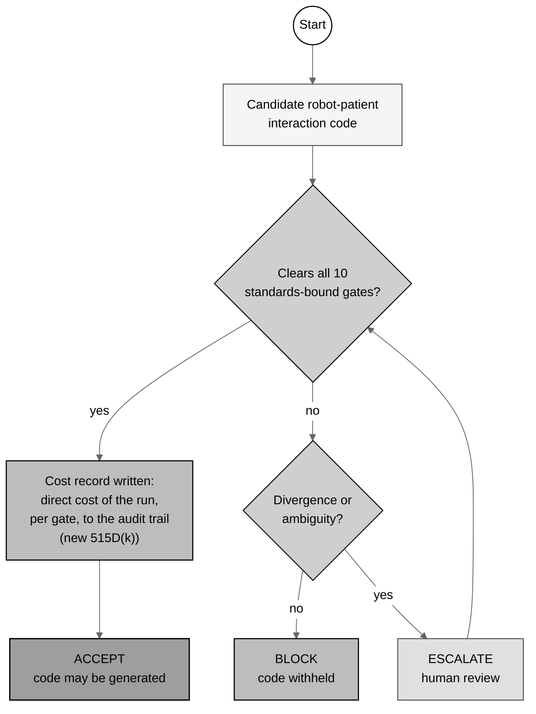
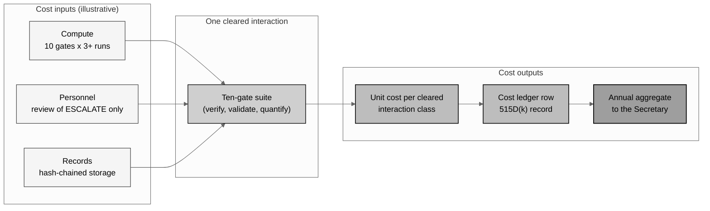
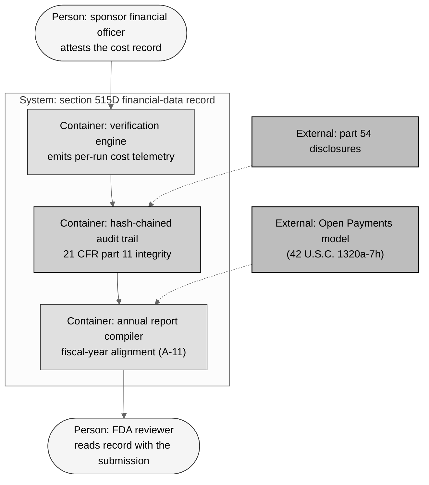
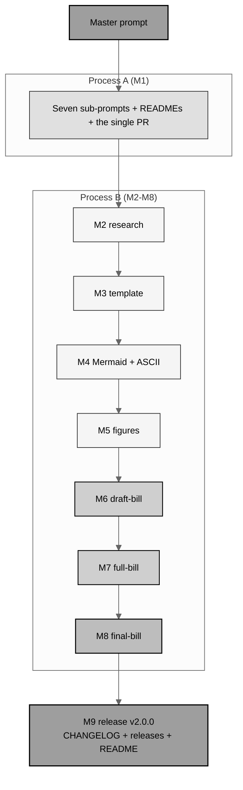

## output-3-mermaid-selection

# Gray-scale Mermaid and ASCII set for H. R. 9510 v5.0

*Independent research draft. Every diagram below is either gray-scale Mermaid
(renders directly in GitHub; reproduced in the compiled LaTeX bill as a
matching gray-scale TikZ figure) or monospace ASCII (set in the bill's
centered, white-background, black-ruled `asciifig` frame). No color, no
images. Dollar figures are illustrative unless tied to a cited statute.*

Bill v5.0 restores the ASCII medium beside gray-scale Mermaid and tables, so
this stage selects **two halves**: six Mermaid diagrams from the families in
`Clinical-AI-Demos/tree/main/ai-outputs/output-01` (each a different type, so
no pattern repeats), and six ASCII forms from the catalog in
`cancer-automated/.../VVUQ-05/update-bill/figures-bill` and the rendered v3.0
figures, every one re-themed to the bill's financial-data subject.

## Shared gray-scale palette (Mermaid half)

The `neutral` theme plus five explicit gray fills, black strokes, black text:
`g1` `#f5f5f5` (inputs/context), `g2` `#e0e0e0` (process steps), `g3` `#cfcfcf`
(decisions/gates), `g4` `#bdbdbd` (law/money controls), `g5` `#9e9e9e` (end
goals/the bill).

## Slot map (both halves)

| Slot | Medium (family) | Bill location | Financial subject |
|:--|:--|:--|:--|
| Cover | ASCII (process overview) | `main.tex` | The v5.0 financial build and money frame |
| Fig. 1 | Mermaid flowchart LR (original workflow) | SEC. 2 | Evidence-to-law-to-cost lineage |
| Fig. 2 | ASCII (side-by-side ledger) | SEC. 2 | Conventional vs autonomous cost ledger |
| Fig. 3 | Mermaid BPMN flowchart (BPMN workflow) | SEC. 3 | Gate decision rule with the cost-record checkpoint |
| Fig. 4 | ASCII (layering map) | SEC. 3 | Statutory layering, extended to the financial sections |
| Fig. 5 | ASCII (ordered list map) | SEC. 4 | Twelve sections in comparative-print order |
| Fig. 6 | Mermaid sequence (PlantUML sequence) | SEC. 5 | Annual financial-data reporting flow |
| Fig. 7 | ASCII (money flow) | SEC. 5 | Appropriations and user fees to program activities |
| Fig. 8 | ASCII (waterfall) | App. A | Budget authority to outlays ramp |
| Fig. 9 | Mermaid clustered component (Graphviz/DOT) | App. B | Unit economics of a ten-gate verification run |
| Fig. 10 | Mermaid C4 view (Structurizr/C4) | App. C | The financial-data system of record |
| Fig. 11 | Mermaid flowchart TB (hybrid) | App. E | The nine-milestone build process |

Why each medium: topology carries the meaning in the six Mermaid slots
(lineage, decision, sequence, pipeline, architecture, build); fixed-width
alignment carries the meaning in the six ASCII slots (ledger columns, layered
statute map, ordered print, money flow, fiscal waterfall); enumerable dollar
data goes to tables (Stage 4).

---

# Half one - the gray-scale Mermaid set

## Figure 1 - Evidence-to-law-to-cost lineage (flowchart LR)

```mermaid
%%{init: {'theme':'neutral','themeVariables':{'fontSize':'13px'}}}%%
flowchart LR
    V1["VVUQ-01<br/>method + 51-test pipeline"]:::g1
    V2["VVUQ-02<br/>10-gate humanoid, 172 tests"]:::g1
    V3["VVUQ-03<br/>standalone bill (v1.0)"]:::g2
    V4["VVUQ-04<br/>FD&C amendment (v2.0)"]:::g2
    V5["v3.0 visual + v4.0 Mermaid<br/>amendments"]:::g4
    B["H. R. 9510 v5.0<br/>the Financial Data Amendment:<br/>cost records + appropriations"]:::g5
    V1 --> V2 --> V3 --> V4 --> V5 --> B
    classDef g1 fill:#f5f5f5,stroke:#333,stroke-width:1px,color:#000
    classDef g2 fill:#e0e0e0,stroke:#333,stroke-width:1px,color:#000
    classDef g4 fill:#bdbdbd,stroke:#000,stroke-width:1.4px,color:#000
    classDef g5 fill:#9e9e9e,stroke:#000,stroke-width:1.6px,color:#000
```



*Slot: SEC. 2(a). A lineage is a left-to-right topology; the financial layer
(what each work cost to reach) sits in Table 1 beside it.*

## Figure 3 - Gate decision rule with the cost-record checkpoint (BPMN flowchart)



*Slot: SEC. 3(a), beside the threshold schedule. The v5.0 change is visible in
the topology itself: the cost record is a mandatory checkpoint on the ACCEPT
path.*

## Figure 6 - Annual financial-data reporting flow (sequence)

```mermaid
%%{init: {'theme':'neutral'}}%%
sequenceDiagram
    autonumber
    participant SP as Sponsor
    participant AT as Hash-chained audit trail (part 11)
    participant SEC as Secretary (FDA)
    participant PUB as Public summary
    participant CON as Congress
    SP->>AT: Cost record per verification run (515D(k))
    SP->>SEC: Annual financial-data report (SEC. 5(a))
    SP->>SEC: Part 54-aligned disclosures (SEC. 5(b))
    SEC->>PUB: De-identified aggregate cost summary
    SEC->>CON: Implementation cost statement with the budget justification
    Note over SP,CON: Gray-scale; no patient-identifiable or proprietary line items published
```

*Slot: SEC. 5(a). A reporting cycle is actor-to-actor message passing; only a
sequence diagram shows who sends what to whom, in order.*

## Figure 9 - Unit economics of a ten-gate verification run (clustered component)



*Slot: Appendix B. The unit-cost pipeline is a component flow with clustered
inputs; the per-gate dollar schedule itself is Table 10 (a table, not a
diagram).*

## Figure 10 - The financial-data system of record (C4 view)



*Slot: Appendix C. An architecture-with-actors view is the C4 genre: people,
containers, and the external financial-law systems the record aligns to.*

## Figure 11 - The nine-milestone build process (hybrid flowchart TB)



*Slot: Appendix E, beside the milestone commit table. The build is a process;
the commit counts are enumerable and stay in the table.*

---

# Half two - the ASCII set

## Cover Figure - the v5.0 financial build and money frame

```
EVIDENCE + LAW (v1.0 - v4.0)                 FINANCIAL FRAME (2026)
+----------------------------------+         +----------------------------------+
| VVUQ-01/02  method + hard proof  |         | PAYGO 2 U.S.C. 931-939           |
| VVUQ-03/04  bill + FD&C 515D     |  =====> | CutGo House Rule XXI cl. 10      |
| v3.0 visual  v4.0 Mermaid        |         | MDUFA V fees 21 U.S.C. 379i-379j |
+----------------------------------+         | part 54 + Open Payments          |
                 |                           +----------------------------------+
                 v                                            |
        single-prompt-bill/auto-bill-02  (this build)         |
        +--------------------------------------------------+  |
        | sub-prompts -> research -> template -> visuals   |<-+
        | -> draft-bill -> full-bill -> final-bill v2.0.0  |
        +--------------------------------------------------+
                 |
                 v
        H. R. 9510 BILL v5.0  <== THE FINANCIAL DATA AMENDMENT
        cost records (515D(k)) + SEC. 5 transparency, user fees,
        authorization of appropriations, budgetary effects
```

*Slot: `main.tex` caption page (the v3.0 cover convention). A fixed-width map
of where the bill sits between the evidence record and the financial frame.*

## Figure 2 - Conventional versus autonomous cost ledger (side-by-side)

```
Conventional path (per trial program)       Four-work autonomous record
+-----------------------------------+       +-----------------------------------+
| Manual code review   $1,800,000/y |       | VVUQ-01  pipeline      ~5 days    |
| Serial V&V cycles      $640,000/y |  vs   | VVUQ-02  10 gates      ~2 days    |
| Re-review after each              |       | VVUQ-03  bill          ~1 day     |
|   change             $310,000/y   |       | VVUQ-04  amendment     ~2 days    |
| Counsel + drafting   $250,000+    |       | compute + records   $48,400 total |
+-----------------------------------+       +-----------------------------------+
   ~$3.0 million per program-year              ~$0.05 million, fixed seed
   (illustrative, fully loaded)                (illustrative, seed 20260525)
```

*Slot: SEC. 2 findings. Ledger columns must align character-for-character;
that is the ASCII medium. All figures illustrative.*

## Figure 4 - Statutory layering, extended to the financial sections

```
Robot-patient interaction code in a Physical AI oncology trial
      |
      v
Is it a "device"?  ................  sec. 321(h)            (s321)
      |   the sec. 360j(o) CDS exclusion does NOT carve out
      |   autonomous robot-control software ......  360j(o) (s360j)
      v
Classify ..........................  sec. 360c              (s360c)
Class II -> 510(k) notice .........  sec. 360(k)            (s360)
Class III -> premarket approval ...  sec. 360e              (s360e)
      +------> PCCP keystone ......  sec. 360e-4            (s360e-4)
               ==> NEW sec. 360e-5  (verify before generation
                   + the 515D(k) COST RECORD)
      
Financial sections the new rule leans on:
 - Device user fees (MDUFA V) .....  secs. 379i, 379j       (s379j)
 - Adulteration / quality .........  sec. 351               (s351)
 - Prohibited acts / enforcement ..  sec. 331               (s331)
 - Real-world evidence ............  sec. 355g              (s355g)
 - State preemption boundary ......  sec. 360k              (s360k)
```

*Slot: SEC. 3(b). The v3.0 layering map, with the user-fee layer added; the
indentation depth is the meaning.*

## Figure 5 - Twelve sections in comparative-print order

```
Twelve affected sections in 21 U.S.C. order (I = insertion, D = deletion)
--------------------------------------------------------------------------
  sec. 301     (s301)     [I]   short-title note: 2026 Amendment
  sec. 321(h)  (s321)     [I]   device definition reaches robot code
  sec. 331     (s331)     [I]   prohibited act (jjj) for a 515D breach
  sec. 351     (s351)     [I]   new (k): adulterated without a record
  sec. 355g    (s355g)    [I]   real world evidence includes 515D records
  sec. 360(k)  (s360)     [I]   verification-governed change: no new 510(k)
  sec. 360c    (s360c)    [I]   new (l): special controls by autonomy
  sec. 360e    (s360e)    [I,D] new (c)(1)(I): record in a PMA
  sec. 360e-4  (s360e-4)  [I]   new (d): the keystone change-control rule
  sec. 360j(o) (s360j)    [I]   CDS exclusion does not reach robot code
  sec. 360k    (s360k)    [I]   new (c): savings clause for State review
  sec. 379j    (s379j)    [I]   NEW: no fee for a verification record alone
```

*Slot: SEC. 4. The print order is a fixed-width ordered list; the twelfth row
is the v5.0 financial addition.*

## Figure 7 - The money flow (appropriations and user fees to activities)

```
            HOW SECTION 515D IMPLEMENTATION IS PAID FOR (SEC. 5)

  Congress: annual appropriations          Industry: MDUFA user fees
  (authorized by SEC. 5(d))                (21 U.S.C. 379i-379j, unchanged)
        |                                        |
        |  budget authority                      |  fee revenue
        v                                        v
  +------------------------------------------------------------------+
  |                  FDA device program (S&E account)                 |
  +------------------------------------------------------------------+
     |                    |                     |                |
     v                    v                     v                v
  rulemaking         verification          sequencing       annual public
  515D(h)            records system        inspections      cost summaries
  (FY27 heavy)       (FY27-28 build,      (steady state)    (de-identified)
                      then O&M)
  NOT permitted: a new statutory fee for filing a verification record
  (SEC. 5(c)); pricing belongs to the MDUFA VI negotiation (by 10/2027)
```

*Slot: SEC. 5(d). Sources, account, and activities align in fixed-width
columns; the dollar schedule itself is Table 6.*

## Figure 8 - Budget authority to outlays (the waterfall)

```
ILLUSTRATIVE FIVE-YEAR PROFILE (authorized BA vs estimated outlays, $ millions)

         FY2027        FY2028        FY2029        FY2030        FY2031
  BA     18 |########  12 |######    10 |#####      9 |####       9 |####
            |              |             |             |             |
  OUT    11 |#####     14 |#######   11 |#####      9 |####       9 |####
            |              |             |             |             |
  spend-out:  60% yr-1 + 30% yr-2 + 10% yr-3   (rulemaking + records build
  cumulative BA 58; cumulative outlays 54 by end FY2031; remainder FY2032)
```

*Slot: Appendix A. A waterfall over fiscal years is bar-by-bar fixed-width
work; the exact series is Table 7. All figures illustrative.*

---

## Reproduction note (Rule 5 analog)

Every Mermaid diagram above is reproduced in the compiled LaTeX bill as a
gray-scale TikZ figure inside the same centered, white-background,
black-ruled frame the ASCII figures use, so the PDF and the Markdown carry the
same twelve visuals. Tables are reserved for enumerable financial data and are
planned in Stage 4.
