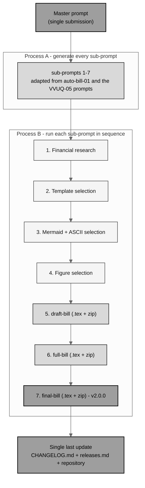

# auto-bill-02 - Autonomous build of H. R. 9510 Bill v5.0

[](https://creativecommons.org/licenses/by/4.0/)
[](.)
[](.)
[](.)
[-10.5281%2Fzenodo.xxxxxxxx-blue.svg)](https://doi.org/10.5281/zenodo.xxxxxxxx)
[-10.5281%2Fzenodo.20576907-blue.svg)](https://doi.org/10.5281/zenodo.20576907)
[](../releases.md)

This directory holds the entire autonomous build of **H. R. 9510 Bill v5.0**, the
*Verification Before Generation in Physical AI Oncology Trials Act of 2026*,
**the Financial Data Amendment**. The build is driven by the single
[`master-prompt.md`](master-prompt.md): Process A generated every sub-prompt
under [`sub-prompts/`](sub-prompts), and Process B runs those sub-prompts in
order, producing the four research stages (`01`-`04`) and the three bill stages
(`draft-bill`, `full-bill`, `final-bill`). Every distinguishable file is a
separate commit pushed in real time; the nine stage milestones are tracked in
one continuously updated pull request (Rules 7, 8, 9).

## The two main updates over Bill v4.0

1. **A comprehensive financial-data focus.** Bill v5.0 is built from the Bill
   v3.0 LaTeX measure (`cancer-automated/papers/VVUQ-05/final-bill`, without its
   `/deliverables`) and adds an operative financial core: a financial-data
   record inside new section 515D, a new SEC. 5 (financial data transparency,
   device user-fee treatment, an authorization of appropriations, and the
   Statutory PAYGO budgetary-effects clause), and four non-operative financial
   appendices (cost estimate and budgetary data; verification economics; the
   financial-data transparency standard; the financial research-influence
   matrix).
2. **Three visual media, each where it is correct.** Bill v4.0 was Mermaid-only;
   Bill v5.0 deliberately carries **tables, ASCII figures, and gray-scale
   Mermaid diagrams** together: full-width tables for enumerable financial
   data, monospace ASCII for ledgers, money flows, and fixed-width timelines,
   and gray-scale Mermaid (real `mermaid` blocks in Markdown, gray-scale TikZ
   in the compiled LaTeX) for processes and systems. No raster images anywhere.

## Build pipeline (gray-scale Mermaid)



## The auto-commit / PR schedule (updated for this run)

The prior build opened one pull request per stage and merged each to `main`.
This run executes in a managed environment that permits exactly one development
branch, `claude/funny-meitner-7ywlgc`, so the schedule is updated (Master prompt,
Rule 8): each prior PR becomes one **stage milestone** - a contiguous, labeled
set of commits, one commit per file, each pushed the moment it is generated -
and all nine milestones are tracked in **one continuously updated pull request**
whose description is refreshed as each milestone lands.

```
M1 bootstrap --> M2 research --> M3 template --> M4 mermaid+ascii --> M5 figures
                                                                          |
                                                                          v
M9 release (v2.0.0) <-- M8 final-bill <-- M7 full-bill <-- M6 draft-bill
```

| Milestone | Stage | Output | Status |
|:--|:--|:--|:--|
| M1 | Bootstrap (Process A) | this README, `master-prompt.md`, `sub-prompts/`; PR opened | in progress |
| M2 | Stage 1 financial research | `01-research/` | pending |
| M3 | Stage 2 template selection | `02-template-selection/` | pending |
| M4 | Stage 3 Mermaid + ASCII selection | `03-mermaid-selection/` | pending |
| M5 | Stage 4 figure selection | `04-figure-selection/` | pending |
| M6 | Stage 5 draft bill | `draft-bill/` (.tex + zip) | pending |
| M7 | Stage 6 full bill | `full-bill/` (.tex + zip) | pending |
| M8 | Stage 7 final bill | `final-bill/` (.tex + zip), repository v2.0.0 | pending |
| M9 | Release (Rule 10) | `CHANGELOG.md`, `releases.md`, root `README.md` | pending |

## Directory map

```
auto-bill-02/
  README.md                 (this file)
  master-prompt.md          (the single submitted Master prompt, verbatim - Rule 14)
  sub-prompts/
    README.md
    prompt-1-research.md            prompt-5-draft-bill.md
    prompt-2-template-selection.md  prompt-6-full-bill.md
    prompt-3-mermaid-selection.md   prompt-7-final-bill.md
    prompt-4-figure-selection.md
  01-research/              (Stage 1)  README.md + output-1-research.md
  02-template-selection/    (Stage 2)  README.md + output-2-template-selection.md
  03-mermaid-selection/     (Stage 3)  README.md + output-3-mermaid-selection.md
  04-figure-selection/      (Stage 4)  README.md + output-4-figure-selection.md
  draft-bill/               (Stage 5)  main.tex, usctitle.sty, references.bib,
                                       sections/, prompt, output, README, zip
  full-bill/                (Stage 6)  same set, fully rendered financial bill
  final-bill/               (Stage 7)  same set, polished to v2.0.0
```

## The v5.0 bill structure (five sections + five appendices)

| Bill part | File | Financial-data role |
|:--|:--|:--|
| SECTION 1 | `main.tex` | Short title; clickable, page-filling table of contents |
| SEC. 2 | `sections/s2-findings.tex` | Findings; the evidence-to-law-to-cost record |
| SEC. 3 | `sections/s3-amendment.tex` | New section 515D (with the financial-data record) and ten conforming amendments |
| SEC. 4 | `sections/s4-comparative.tex` | Comparative print; twelve affected sections including the user-fee section |
| SEC. 5 | `sections/s5-financial.tex` | Financial data transparency; user fees; authorization of appropriations; budgetary effects |
| Appendix A | `sections/a6-cost-estimate.tex` | Cost estimate and budgetary data (non-operative) |
| Appendix B | `sections/a7-verification-economics.tex` | Verification economics and financial evidence (non-operative) |
| Appendix C | `sections/a8-financial-standard.tex` | The financial-data transparency standard (non-operative) |
| Appendix D | `sections/a9-research-matrix.tex` | Research influence matrix, financial (non-operative) |
| Appendix E | `sections/a10-transparency.tex` | Development transparency and commit schedule |

## Sources used from other repositories (Rule 6)

| No. | Asset used | Upstream source | Used in |
|:--|:--|:--|:--|
| 01 | The Bill v3.0 LaTeX measure: `main.tex`, `usctitle.sty` (ASCII and table primitives), `references.bib`, eight section files | `cancer-automated/.../papers/VVUQ-05/final-bill` (no `/deliverables`) | all three bill stages |
| 02 | Gray-scale Mermaid TikZ primitives and the v4.0 build conventions | `single-prompt-bill/auto-bill-01/final-bill` (`usctitle.sty`, `main.tex`) | `usctitle.sty` of every bill stage |
| 03 | Mermaid diagram families (flowchart, sequence, component, swimlane, BPMN, C4, clustered) | `Clinical-AI-Demos/.../ai-outputs/output-01` | `03-mermaid-selection/`; the Mermaid figures |
| 04 | ASCII visual catalog and figure-type taxonomy | `cancer-automated/.../VVUQ-05/update-bill/figures-bill` | `03-mermaid-selection/`, `04-figure-selection/`; the ASCII figures |
| 05 | Pre-introduction research method and 2026 process facts | `cancer-automated/.../VVUQ-05/update-bill/next-steps`; `auto-bill-01/01-research` | `01-research/` |
| 06 | Draft scaffold conventions (bracketed drafting instructions) | `cancer-automated/.../VVUQ-05/draft-bill`; `auto-bill-01/draft-bill` | `draft-bill/` |
| 07 | Full-bill rendering conventions (figure and table inventory, DOI) | `cancer-automated/.../VVUQ-05/full-bill` (prompt); `auto-bill-01/full-bill` | `full-bill/` |
| 08 | Final polish, reference white-space formatting, page balancing | `cancer-automated/.../VVUQ-05/final-bill`; `auto-bill-01/final-bill` | `final-bill/` |
| 09 | PAYGO and fiscal-note genre conventions | `auto-bill-01/final-bill/sections/g-paygo-cost.tex` | SEC. 5, Appendix A |

## Versioning

- **Bill content version:** H. R. 9510 **v5.0** (the fifth bill perspective,
  after VVUQ-03 v1.0, VVUQ-04 v2.0, VVUQ-05 v3.0, and auto-bill-01 v4.0).
- **Repository release:** **v2.0.0** (this build; the first release was the
  v1.0.0 auto-bill-01 build).
- **DOI** for the v5.0 bill is left as `10.5281/zenodo.xxxxxxxx`
  ([https://doi.org/10.5281/zenodo.xxxxxxxx](https://doi.org/10.5281/zenodo.xxxxxxxx))
  pending deposit (Rule 15).

## License

Released under CC BY 4.0; reproduced public-domain U.S. Government statutory
text is used under 17 U.S.C. § 105. Author: Kevin Kawchak, CEO ChemicalQDevice
([ORCID 0009-0007-5457-8667](https://orcid.org/0009-0007-5457-8667)).

*Independent research draft. Not an enacted law, not pending legislation, and
not legal advice; not endorsed by the FDA, HHS, the OLRC, CBO, GAO, OMB, CFR,
ICH, or any Member of Congress. The illustrative number "H. R. 9510" is a
placeholder; the Clerk assigns the real number only at introduction. All dollar
figures in this build are illustrative or simulation results unless tied to a
cited statute or notice.*
