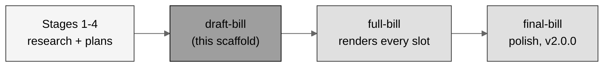

# draft-bill (LaTeX): H. R. 9510 Bill v5.0 - the scaffold

[](https://creativecommons.org/licenses/by/4.0/)
[-blue.svg)](.)
[](.)
[-lightgrey.svg)](.)
[](.)

The **draft scaffold** of H. R. 9510 Bill v5.0, the *Verification Before
Generation in Physical AI Oncology Trials Act of 2026*, **the Financial Data
Amendment** to the Federal Food, Drug, and Cosmetic Act (21 U.S.C. § 301 et
seq.), current through Public Law 119-93. The scaffold lays the complete v5.0
architecture - five operative sections, five financial appendices, the merged
three-media style, the full bibliography - with bracketed [DRAFTING
INSTRUCTIONS] naming the exact upstream files and the figure or table medium
for every slot. It compiles in Overleaf as committed; the
[`../full-bill`](../full-bill) executes every instruction.

## Build pipeline position (gray-scale Mermaid)



## Repository structure

```
auto-bill-02/draft-bill/
  README.md   main.tex   usctitle.sty   references.bib
  draft-bill-LaTeX.zip   prompt-draft-bill.md   output-draft-bill.md
  sections/
    s2-findings.tex               (SEC. 2  findings; evidence-to-law-to-cost)
    s3-amendment.tex              (SEC. 3  515D + financial-data record (k))
    s4-comparative.tex            (SEC. 4  comparative print, twelve sections)
    s5-financial.tex              (SEC. 5  the operative financial core)
    a6-cost-estimate.tex          (App. A  cost estimate and budgetary data)
    a7-verification-economics.tex (App. B  verification economics)
    a8-financial-standard.tex     (App. C  financial-data transparency standard)
    a9-research-matrix.tex        (App. D  research influence matrix, financial)
    a10-transparency.tex          (App. E  development transparency)
```

## Sources used from other repositories and directories (Rule 6)

| Used here | Upstream source | Where used |
|:--|:--|:--|
| Bill apparatus, ASCII and table primitives, section architecture | `cancer-automated/.../papers/VVUQ-05/final-bill` (`main.tex`, `usctitle.sty` v3.1.0, `sections/`) - no `/deliverables` | `main.tex`, `usctitle.sty`, all scaffolds |
| Gray-scale Mermaid TikZ primitives, `\billbox` | `single-prompt-bill/auto-bill-01/final-bill/usctitle.sty` v4.0.0 | `usctitle.sty` |
| Provenance and research bibliography (carried unchanged) | `cancer-automated/.../VVUQ-05/final-bill/references.bib` | `references.bib` |
| The v5.0 financial authorities added to the bibliography | `auto-bill-02/01-research/output-1-research.md` | `references.bib`, SEC. 5, App. A-D instructions |
| The twelve visuals named in the slots | `auto-bill-02/03-mermaid-selection/output-3-mermaid-selection.md` | every figure slot |
| The numbered figure and table plan | `auto-bill-02/04-figure-selection/output-4-figure-selection.md` | every slot label |
| Draft scaffold conventions (bracketed instructions) | `cancer-automated/.../VVUQ-05/draft-bill`; `auto-bill-01/draft-bill` | all `sections/*.tex` |

## Compile recipe (Overleaf, pdfLaTeX)

```
pdflatex main.tex
bibtex   main
pdflatex main.tex
pdflatex main.tex
```

Set the Overleaf compiler to **pdfLaTeX**. The body font is Times-like via
`newtxtext`/`newtxmath`; ASCII figures use `fancyvrb` (BVerbatim, framed,
centered); Mermaid figures are gray-scale TikZ; there are no images.
`draft-bill-LaTeX.zip` is the Overleaf-ready bundle.

## License

Released under CC BY 4.0; reproduced public-domain U.S. Government statutory
text is used under 17 U.S.C. § 105. Author: Kevin Kawchak, CEO ChemicalQDevice
([ORCID 0009-0007-5457-8667](https://orcid.org/0009-0007-5457-8667)).
