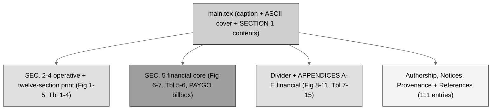

# final-bill (LaTeX): H. R. 9510 Bill v5.0 - polished, v2.0.0

[](https://creativecommons.org/licenses/by/4.0/)
[-brightgreen.svg)](.)
[](.)
[](.)
[](.)
[-10.5281%2Fzenodo.20619762-blue.svg)](https://doi.org/10.5281/zenodo.20619762)
[](../../releases.md)
[](.)

PDF and LaTeX source files are available on [Zenodo](https://doi.org/10.5281/zenodo.20619762) for H. R. 9510 Bill v5.0, the *Verification Before
Generation in Physical AI Oncology Trials Act of 2026*, **the Financial Data
Amendment** to the Federal Food, Drug, and Cosmetic Act (21 U.S.C. § 301 et
seq.), current through Public Law 119-93. It is the
[`../full-bill`](../full-bill) with the senior-author corrections learned
across both prior draft-to-full-to-final cycles, and it marks **repository
release v2.0.0**. Its context and formatting quality are intended to match and
exceed the prior `VVUQ-05/final-bill` (v3.0) and `auto-bill-01/final-bill`
(v4.0). No raster images; the three media are full-width tables (right-aligned
`R` dollar columns), centered ASCII frames, and gray-scale Mermaid as TikZ.

## The polish applied (full bill to final bill)

1. **Page balancing**: SEC. 3, SEC. 4, and SEC. 5 begin on fresh pages; a
   clean divider ("APPENDICES: THE FINANCIAL PERSPECTIVE") opens the appendix
   block, and Appendix A cedes its page break to the divider.
2. **Cover, header, and style finalization**: the polished-final cover note;
   `usctitle.sty` v5.2.0.
3. **Caption and consistency pass**: no stranded short last lines; single
   hyphens only; § for every codified reference; every dollar series re-summed
   (Table 1 = 48,400; Table 2 column = 3,710 composing to Table 10 = 4,420;
   Table 6 = 58.0 by row and column; Table 7 = 53.5 + 4.5; Table 11 =
   3,000,000 vs 155,000).

## Bill structure (gray-scale Mermaid)



## Repository structure

```
auto-bill-02/final-bill/
  README.md   main.tex   usctitle.sty   references.bib
  final-bill-LaTeX.zip   prompt-final-bill.md   output-final-bill.md
  sections/
    s2-findings.tex               (SEC. 2  Fig 1-2, Tbl 1)
    s3-amendment.tex              (SEC. 3  Fig 3-4, Tbl 2-3; 515D + (k))
    s4-comparative.tex            (SEC. 4  Fig 5, Tbl 4; twelve sections)
    s5-financial.tex              (SEC. 5  Fig 6-7, Tbl 5-6; billbox)
    a6-cost-estimate.tex          (App. A  Fig 8, Tbl 7-9)
    a7-verification-economics.tex (App. B  Fig 9, Tbl 10-11)
    a8-financial-standard.tex     (App. C  Fig 10, Tbl 12)
    a9-research-matrix.tex        (App. D  Tbl 13)
    a10-transparency.tex          (App. E  Fig 11, Tbl 14-15)
```

## Sources used from other repositories and directories (Rule 6)

| Used here | Upstream source | Where used |
|:--|:--|:--|
| Operative text, comparative print, apparatus, ASCII and table primitives | `cancer-automated/.../papers/VVUQ-05/final-bill` (no `/deliverables`) | SEC. 2-4, `main.tex`, `usctitle.sty` |
| Mermaid TikZ primitives, `\billbox`, the final-polish conventions (divider, page balance) | `single-prompt-bill/auto-bill-01/final-bill` | `usctitle.sty`, the six TikZ figures, this polish |
| The financial authorities | `auto-bill-02/01-research/output-1-research.md` | SEC. 5, App. A-D, `references.bib` |
| The visual set and the numbered plan | `auto-bill-02/03-mermaid-selection`, `04-figure-selection` | every figure and table |
| The rendered base this stage polishes | `auto-bill-02/full-bill` | everything |

## Compile recipe (Overleaf, pdfLaTeX)

```
pdflatex main.tex
bibtex   main
pdflatex main.tex
pdflatex main.tex
```

Set the Overleaf compiler to **pdfLaTeX**. `final-bill-LaTeX.zip` is the
Overleaf-ready bundle. There are no images and no external assets beyond the
four file types.

## License

Released under CC BY 4.0; reproduced public-domain U.S. Government statutory
text is used under 17 U.S.C. § 105. Author: Kevin Kawchak, CEO ChemicalQDevice
([ORCID 0009-0007-5457-8667](https://orcid.org/0009-0007-5457-8667)).
