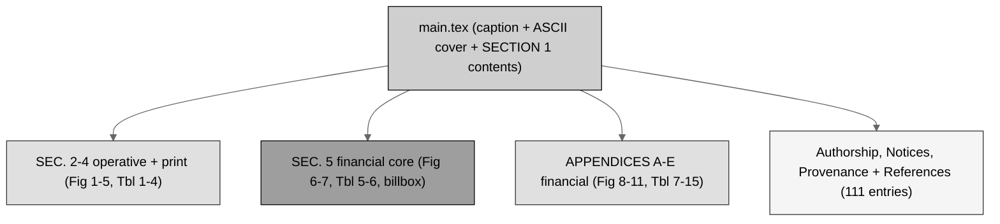

# full-bill (LaTeX): H. R. 9510 Bill v5.0 - rendered

[](https://creativecommons.org/licenses/by/4.0/)
[-blue.svg)](.)
[](.)
[](.)
[](.)
[-10.5281%2Fzenodo.xxxxxxxx-blue.svg)](https://doi.org/10.5281/zenodo.xxxxxxxx)
[](.)

The **full** H. R. 9510 Bill v5.0, the *Verification Before Generation in
Physical AI Oncology Trials Act of 2026*, **the Financial Data Amendment** to
the Federal Food, Drug, and Cosmetic Act (21 U.S.C. § 301 et seq.), current
through Public Law 119-93. Produced from the [`../draft-bill`](../draft-bill)
scaffold by executing every bracketed drafting instruction: the operative new
section 515D carried with the new **financial-data record (k)**, the
comparative print widened to **twelve sections** (including § 379j, the
user-fee section), the new **SEC. 5 financial core**, and the five financial
appendices - all rendered in the three media (full-width tables with
right-aligned dollar columns, centered ASCII frames, gray-scale Mermaid as
TikZ). No images; all dollar figures illustrative unless tied to a cited
statute or notice.

## Bill structure (gray-scale Mermaid)



## Figure and table inventory (the three media)

| Slot | Title | Medium | Where |
|:--|:--|:--|:--|
| Cover | The v5.0 financial build and money frame | ASCII | `main.tex` |
| Fig. 1 | Evidence-to-law-to-cost lineage | Mermaid (TikZ) | SEC. 2 |
| Fig. 2 | Conventional vs autonomous cost ledger | ASCII | SEC. 2 |
| Fig. 3 | Gate decision rule with cost-record checkpoint | Mermaid (TikZ) | SEC. 3 |
| Fig. 4 | Statutory layering with the financial sections | ASCII | SEC. 3 |
| Fig. 5 | Twelve sections in comparative-print order | ASCII | SEC. 4 |
| Fig. 6 | Annual financial-data reporting flow | Mermaid (TikZ) | SEC. 5 |
| Fig. 7 | Appropriations and user fees to activities | ASCII | SEC. 5 |
| Fig. 8 | Budget authority to outlays waterfall | ASCII | App. A |
| Fig. 9 | Unit economics of a ten-gate run | Mermaid (TikZ) | App. B |
| Fig. 10 | The financial-data system of record | Mermaid (TikZ) | App. C |
| Fig. 11 | The nine-milestone build process | Mermaid (TikZ) | App. E |
| Tbl. 1 | Four works with the financial footprint | table | SEC. 2 |
| Tbl. 2 | Ten-gate threshold schedule with unit costs | table | SEC. 3 |
| Tbl. 3 | Ten conforming amendments crosswalk | table | SEC. 3 |
| Tbl. 4 | Twelve-section comparative change map | table | SEC. 4 |
| Tbl. 5 | Financial-data elements dictionary | table | SEC. 5 |
| Tbl. 6 | Authorization of appropriations schedule | table | SEC. 5 |
| Tbl. 7 | Estimated budget authority and outlays | table | App. A |
| Tbl. 8 | Statutory device user-fee structure | table | App. A |
| Tbl. 9 | Scorecard and mandates summary | table | App. A |
| Tbl. 10 | Per-gate verification unit-cost schedule | table | App. B |
| Tbl. 11 | Acceleration economics summary | table | App. B |
| Tbl. 12 | The financial-data transparency standard | table | App. C |
| Tbl. 13 | Research influence matrix, financial | table | App. D |
| Tbl. 14 | Bill version lineage | table | App. E |
| Tbl. 15 | The nine-milestone commit schedule | table | App. E |

## Repository structure

```
auto-bill-02/full-bill/
  README.md   main.tex   usctitle.sty   references.bib
  full-bill-LaTeX.zip   prompt-full-bill.md   output-full-bill.md
  sections/
    s2-findings.tex               s5-financial.tex
    s3-amendment.tex              a6-cost-estimate.tex
    s4-comparative.tex            a7-verification-economics.tex
    a8-financial-standard.tex     a9-research-matrix.tex
    a10-transparency.tex
```

## Sources used from other repositories and directories (Rule 6)

| Used here | Upstream source | Where used |
|:--|:--|:--|
| Operative 515D text, conforming amendments, comparative print (eleven sections), findings basis | `cancer-automated/.../papers/VVUQ-05/final-bill/sections` (no `/deliverables`) | SEC. 2, 3, 4 |
| Bill apparatus, ASCII and table primitives | `cancer-automated/.../VVUQ-05/final-bill` (`main.tex`, `usctitle.sty` v3.1.0) | `main.tex`, `usctitle.sty` |
| Gray-scale Mermaid TikZ primitives, `\billbox` | `auto-bill-01/final-bill/usctitle.sty` v4.0.0 | `usctitle.sty`, six TikZ figures, SEC. 5(e) |
| The financial authorities and vocabulary | `auto-bill-02/01-research/output-1-research.md` | SEC. 2(c)-(h), SEC. 5, App. A-D |
| The twelve visuals | `auto-bill-02/03-mermaid-selection/output-3-mermaid-selection.md` | every figure |
| The numbered plan | `auto-bill-02/04-figure-selection/output-4-figure-selection.md` | every slot |
| Fiscal-note genre conventions | `auto-bill-01/final-bill/sections/g-paygo-cost.tex` | App. A |
| Carried bibliography plus the financial layer | `cancer-automated/.../VVUQ-05/final-bill/references.bib`; Stage 1 | `references.bib` (111 entries) |

## Compile recipe (Overleaf, pdfLaTeX)

```
pdflatex main.tex
bibtex   main
pdflatex main.tex
pdflatex main.tex
```

Set the Overleaf compiler to **pdfLaTeX**. Times-like body via
`newtxtext`/`newtxmath`; ASCII figures via `fancyvrb` (BVerbatim, framed,
centered); Mermaid figures as gray-scale TikZ; no images.
`full-bill-LaTeX.zip` is the Overleaf-ready bundle.

## License

Released under CC BY 4.0; reproduced public-domain U.S. Government statutory
text is used under 17 U.S.C. § 105. Author: Kevin Kawchak, CEO ChemicalQDevice
([ORCID 0009-0007-5457-8667](https://orcid.org/0009-0007-5457-8667)).
